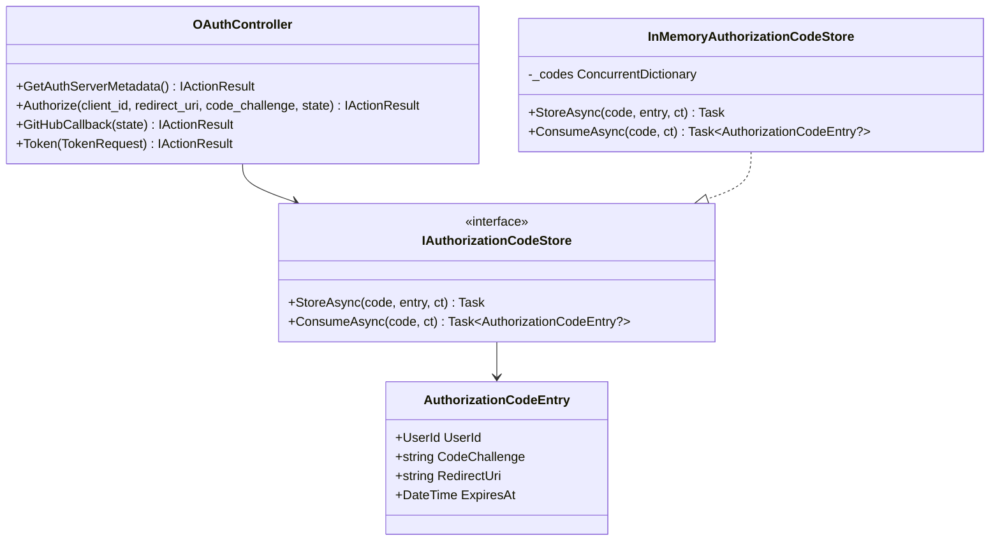

## Plan — MCP OAuth 2.1 + PKCE (remplacement API Key)
**Date :** 2026-04-08
**Itération :** #26
**Statut :** ready

---

### Contexte

L'itération #25 a ajouté un serveur MCP protégé par une API Key propriétaire (`kairu_xxx`).
Cette approche impose un flux manuel (génération, copie, configuration dans chaque client IA).
L'itération #26 remplace ce mécanisme par OAuth 2.1 + PKCE pour que les clients MCP
(Claude Code, Codex) puissent se connecter nativement via le flux standard MCP Authorization.

Le SDK `ModelContextProtocol.AspNetCore` 1.2.0 fournit `McpAuthenticationHandler` dans
`ModelContextProtocol.AspNetCore.Authentication`. Ce handler retourne le resource metadata
dans les challenges 401, ce qui permet à un client MCP conforme (draft spec 2025-03-26) de
découvrir l'authorization server et d'initier le flux PKCE automatiquement.

ADR de référence : ADR-013 (à créer dans spec.md lors de l'étape DOCUMENTER).

---

### Architecture du flux OAuth 2.1

#### Rôles

- **Kairu API** = Resource Server (endpoint `/mcp`) ET Authorization Server (endpoints `/oauth/*`)
- **Client MCP** (Claude Code, Codex) = Public Client (pas de client_secret)
- **GitHub OAuth** = Identity Provider (inchangé — le flux Web existant n'est pas touché)

#### Découverte (Discovery)

| Endpoint | Méthode | Description |
|---|---|---|
| `/.well-known/oauth-protected-resource/mcp` | GET | Resource metadata — géré par le SDK (`McpAuthenticationHandler`) |
| `/.well-known/oauth-authorization-server` | GET | Authorization server metadata (endpoint custom à créer) |

#### Flux Authorization Code + PKCE

```
Client MCP                    Kairu API                     GitHub
    |                             |                             |
    |-- GET /mcp ----------------->|                             |
    |<-- 401 + WWW-Auth (resource_metadata_uri) --------------- |
    |                             |                             |
    |-- GET /.well-known/oauth-protected-resource/mcp ---------->|
    |<-- { authorization_servers: [...] } -------------------- |
    |                             |                             |
    |-- GET /.well-known/oauth-authorization-server ------------>|
    |<-- { authorization_endpoint, token_endpoint, ... } ------ |
    |                             |                             |
    |-- GET /oauth/authorize                                     |
    |   ?client_id=kairu-mcp                                    |
    |   &redirect_uri={client_callback}                         |
    |   &code_challenge={S256}                                  |
    |   &code_challenge_method=S256                             |
    |   &state={opaque} ---------------------------------------->|
    |                             |                             |
    |         (Kairu stocke PKCE challenge + state en mémoire) |
    |                             |-- GET /login/oauth/authorize ->|
    |                             |<-- redirect /signin-github ---|
    |                             |-- GET /api/auth/github/callback (cookie) |
    |                             |   (GetOrCreateUser → Kairu UserId)       |
    |                             |                             |
    |                             | (Kairu génère authorization_code, stocke |
    |                             |  code + UserId + code_challenge en RAM)  |
    |                             |                             |
    |<-- redirect {redirect_uri}?code={code}&state={state} -----  |
    |                             |                             |
    |-- POST /oauth/token                                        |
    |   code={code}                                             |
    |   code_verifier={verifier}                                |
    |   grant_type=authorization_code                           |
    |   redirect_uri={client_callback} ------------------------->|
    |                             |                             |
    |         (Kairu vérifie code + PKCE S256, génère JWT Kairu)|
    |                             |                             |
    |<-- { access_token: {JWT}, token_type: "Bearer", ... } --- |
    |                             |                             |
    |-- GET /mcp (Authorization: Bearer {JWT}) ----------------->|
    |<-- MCP response ----------------------------------------- |
```

#### Points clés de sécurité

- PKCE S256 obligatoire (pas de `plain`)
- `state` opaque requis (protection CSRF)
- `authorization_code` à usage unique, TTL 5 minutes, stocké in-memory
- `redirect_uri` doit correspondre exactement à la valeur enregistrée à l'étape `/oauth/authorize`
- Pas de `client_secret` (public client)
- `client_id` = `kairu-mcp` (statique, pas de Dynamic Client Registration pour le MVP)
- JWT identique au flux Web (claim `sub` = UserId GUID, HS256, expiry configurable)

---

### Modèle domaine

Aucune nouvelle entité persistée. Le flux OAuth est **stateless côté base de données**.

#### Value Objects (nouveaux, dans `Kairu.Domain.OAuth` ou inline dans Application)

- Pas de Value Objects domaine dédiés — le flux OAuth est applicatif, pas métier.

#### Stockage in-memory des codes d'autorisation

Un service applicatif `IAuthorizationCodeStore` (interface dans Application, implémentation en Infrastructure) :

```
IAuthorizationCodeStore
  StoreAsync(code, entry, ct)          → void
  ConsumeAsync(code, ct)               → AuthorizationCodeEntry?
```

`AuthorizationCodeEntry` (record dans Application) :
```
record AuthorizationCodeEntry(
    UserId UserId,
    string CodeChallenge,        // SHA-256 base64url du code_verifier
    string RedirectUri,
    DateTime ExpiresAt
)
```

L'implémentation `InMemoryAuthorizationCodeStore` utilise un `ConcurrentDictionary<string, AuthorizationCodeEntry>` avec nettoyage passif à la consommation.

---

### Use Cases (non CQRS — ce sont des handlers HTTP directs dans le controller)

Le flux OAuth ne suit pas le pattern CQRS Commands/Queries car il s'agit de protocole HTTP
avec des redirections et des échanges de tokens, pas d'opérations métier sur des agrégats.
Les endpoints OAuth sont implémentés directement dans `OAuthController`.

---

### Fichiers à supprimer

#### Domain
- `src/Kairu.Domain/Settings/UserApiKey.cs`
- `src/Kairu.Domain/Settings/IApiKeyRepository.cs`

#### Application
- `src/Kairu.Application/Settings/Commands/GenerateApiKey/GenerateApiKeyCommand.cs`
- `src/Kairu.Application/Settings/Commands/GenerateApiKey/GenerateApiKeyCommandHandler.cs`
- `src/Kairu.Application/Settings/Commands/GenerateApiKey/GenerateApiKeyResult.cs`
- `src/Kairu.Application/Settings/Commands/RevokeApiKey/RevokeApiKeyCommand.cs`
- `src/Kairu.Application/Settings/Commands/RevokeApiKey/RevokeApiKeyCommandHandler.cs`
- `src/Kairu.Application/Settings/Commands/RevokeApiKey/RevokeApiKeyResult.cs`
- `src/Kairu.Application/Settings/Queries/GetApiKey/GetApiKeyQuery.cs`
- `src/Kairu.Application/Settings/Queries/GetApiKey/GetApiKeyQueryHandler.cs`
- `src/Kairu.Application/Settings/Queries/GetApiKey/GetApiKeyResult.cs`

#### Infrastructure
- `src/Kairu.Infrastructure/Persistence/Repositories/EfCoreApiKeyRepository.cs`
- `src/Kairu.Infrastructure/Persistence/UserApiKeyConfiguration.cs`
- `src/Kairu.Infrastructure/Persistence/Migrations/20260407222832_AddUserApiKeys.cs`
- `src/Kairu.Infrastructure/Persistence/Migrations/20260407222832_AddUserApiKeys.Designer.cs`

#### API
- `src/Kairu.Api/Mcp/ApiKeyAuthHandler.cs`
- `src/Kairu.Api/Mcp/ApiKeyAuthOptions.cs`
- `src/Kairu.Api/Settings/ApiKeyController.cs`

#### Tests
- `tests/Kairu.Application.Tests/Settings/FakeApiKeyRepository.cs`
- `tests/Kairu.Application.Tests/Settings/GenerateApiKeyCommandHandlerTests.cs`
- `tests/Kairu.Application.Tests/Settings/GetApiKeyQueryHandlerTests.cs`
- `tests/Kairu.Application.Tests/Settings/RevokeApiKeyCommandHandlerTests.cs`

---

### Fichiers à modifier

#### Infrastructure
- `src/Kairu.Infrastructure/Persistence/KairuDbContext.cs`
  - Supprimer `DbSet<UserApiKey> UserApiKeys`
  - Supprimer `modelBuilder.ApplyConfiguration(new UserApiKeyConfiguration())`
- `src/Kairu.Infrastructure/DependencyInjection.cs`
  - Supprimer `services.AddScoped<IApiKeyRepository, EfCoreApiKeyRepository>()`
  - Ajouter `services.AddSingleton<IAuthorizationCodeStore, InMemoryAuthorizationCodeStore>()`

#### API — Program.cs
Remplacer le schéma `ApiKey` par `AddMcp()` du SDK :

```
// AVANT
builder.Services
    .AddAuthentication(...)
    .AddScheme<ApiKeyAuthOptions, ApiKeyAuthHandler>("ApiKey", _ => { });

builder.Services.AddAuthorization(options =>
    options.AddPolicy("McpApiKey", policy =>
        policy.AddAuthenticationSchemes("ApiKey")
              .RequireAuthenticatedUser()));

// ...
app.MapMcp("/mcp").RequireAuthorization("McpApiKey");

// APRES
builder.Services
    .AddAuthentication(...)
    // Schéma MCP (retourne resource metadata dans les 401)
    .AddMcp(options =>
    {
        options.ResourceMetadata = new ResourceMetadata
        {
            Resource = new Uri("https://[host]/mcp"),
            AuthorizationServers = [new Uri("https://[host]")],
            BearerMethodsSupported = ["header"]
        };
    });

builder.Services.AddAuthorization(options =>
    options.AddPolicy("McpPolicy", policy =>
        policy.AddAuthenticationSchemes(JwtBearerDefaults.AuthenticationScheme)
              .RequireAuthenticatedUser()));

// ...
app.MapMcp("/mcp").RequireAuthorization("McpPolicy");
```

Note : `AddMcp()` est la méthode d'extension sur `AuthenticationBuilder` fournie par
`ModelContextProtocol.AspNetCore.Authentication`. A vérifier dans la doc du SDK 1.2.0
avant implémentation — l'API exacte n'est pas garantie.

#### Web — Settings.razor
- Supprimer la section "Clé API (MCP)" (lignes 52-113)
- Supprimer les champs d'état : `_apiKeyLoading`, `_apiKeyBusy`, `_apiKeyExists`, `_apiKeyCreatedAt`, `_apiKeyToken`, `_apiKeyError`, `_copied`
- Supprimer les méthodes : `LoadApiKeyStatusAsync`, `GenerateApiKey`, `RevokeApiKey`, `CopyToken`, `DismissToken`
- Supprimer l'appel `await LoadApiKeyStatusAsync()` dans `OnInitializedAsync`

#### Web — SettingsApiClient.cs
- Supprimer `ApiKeyStatusDto`, `ApiKeyTokenDto`
- Supprimer `GetApiKeyStatusAsync`, `GenerateApiKeyAsync`, `RevokeApiKeyAsync`

---

### Fichiers à créer

#### Application
- `src/Kairu.Application/OAuth/IAuthorizationCodeStore.cs`
  Interface + record `AuthorizationCodeEntry`

#### Infrastructure
- `src/Kairu.Infrastructure/OAuth/InMemoryAuthorizationCodeStore.cs`
  Implémentation `ConcurrentDictionary` + TTL

#### API — OAuth Controller
- `src/Kairu.Api/OAuth/OAuthController.cs`
  Contient 4 endpoints :

**1. `GET /.well-known/oauth-authorization-server`**
Retourne le Authorization Server Metadata (RFC 8414) :
```json
{
  "issuer": "https://[host]",
  "authorization_endpoint": "https://[host]/oauth/authorize",
  "token_endpoint": "https://[host]/oauth/token",
  "response_types_supported": ["code"],
  "code_challenge_methods_supported": ["S256"],
  "grant_types_supported": ["authorization_code"]
}
```

**2. `GET /oauth/authorize`**
Paramètres : `client_id`, `redirect_uri`, `response_type=code`, `code_challenge`,
`code_challenge_method=S256`, `state`.

Validation :
- `client_id` == `kairu-mcp` (seul client autorisé pour le MVP)
- `response_type` == `code`
- `code_challenge_method` == `S256`
- `code_challenge` non vide
- `redirect_uri` non vide

Comportement :
1. Stocker en session (cookie chiffré ou query string dans le callback) : `code_challenge`, `redirect_uri`, `state`
2. Rediriger vers GitHub OAuth via `Challenge("GitHub", properties)` avec un `RedirectUri`
   pointant vers `/oauth/github/callback?state={state}`

**3. `GET /oauth/github/callback`**
(Callback interne — différent de `/api/auth/github/callback` qui sert le flux Web)

Comportement :
1. Lire l'identité GitHub depuis le Cookie (même mécanique que `AuthController.GitHubCallback`)
2. Appeler `GetOrCreateUserCommand` pour obtenir le `UserId`
3. Générer un `authorization_code` cryptographiquement aléatoire (32 bytes, base64url)
4. Stocker dans `IAuthorizationCodeStore` : `{ UserId, CodeChallenge, RedirectUri, ExpiresAt = now + 5min }`
5. Rediriger vers `redirect_uri?code={code}&state={state}`

**4. `POST /oauth/token`**
Body form-urlencoded : `grant_type=authorization_code`, `code`, `code_verifier`, `redirect_uri`, `client_id`.

Validation :
- `grant_type` == `authorization_code`
- `client_id` == `kairu-mcp`
- Consommer le code depuis `IAuthorizationCodeStore` (retourne null si inconnu ou expiré)
- Vérifier PKCE : `BASE64URL(SHA256(code_verifier))` == `code_challenge` stocké
- Vérifier `redirect_uri` == valeur stockée
- Vérifier TTL (entry.ExpiresAt > now)

Réponse succès :
```json
{
  "access_token": "{JWT Kairu}",
  "token_type": "Bearer",
  "expires_in": 86400
}
```

Réponse erreur : `400 Bad Request` avec `{ "error": "invalid_grant" }` (RFC 6749 §5.2).

#### API — Diagramme de classes (Mermaid)



---

### Migration EF Core

**Nouvelle migration : `DropUserApiKeys`**

```sql
-- Up
DROP TABLE [UserApiKeys];

-- Down
CREATE TABLE [UserApiKeys] (
    [Id] uniqueidentifier NOT NULL,
    [KeyHash] nvarchar(64) NOT NULL,
    [CreatedAt] datetime2 NOT NULL,
    CONSTRAINT [PK_UserApiKeys] PRIMARY KEY ([Id])
);
CREATE UNIQUE INDEX [IX_UserApiKeys_KeyHash] ON [UserApiKeys] ([KeyHash]);
```

La migration est générée via `dotnet ef migrations add DropUserApiKeys` après suppression
de `UserApiKey`, `IApiKeyRepository`, et nettoyage de `KairuDbContext`.

---

### Contraintes techniques observées

1. **`ClaimsCurrentUserService`** : inchangé — lit le claim `sub` depuis le JWT. Le JWT émis
   par `/oauth/token` doit avoir exactement la même structure que celui du flux Web.

2. **Conflit de callback GitHub** : le flux Web utilise `/api/auth/github/callback` comme
   `RedirectUri` de `AuthController`. Le flux OAuth MCP doit utiliser un callback différent
   (`/oauth/github/callback`) pour éviter la collision. Les deux callbacks lisent le cookie
   déposé par `AddOAuth("GitHub", ...)` via `CallbackPath = "/signin-github"`.

   Attention : `CallbackPath` dans `AddOAuth("GitHub", ...)` est unique — les deux flows
   passent par le même `/signin-github`, puis sont redirigés vers leur callback respectif
   selon la `RedirectUri` stockée dans les `AuthenticationProperties`.

3. **Stockage du `code_challenge` pendant le redirect GitHub** : entre `/oauth/authorize` et
   `/oauth/github/callback`, l'état PKCE doit être préservé. Options :
   - Option A (recommandée) : stocker dans un cookie chiffré signé (via `IDataProtector`)
     côté serveur, lu dans le callback. Évite d'exposer le challenge dans l'URL.
   - Option B : passer via le `state` (côté client) — mais le `state` est propriété du
     client MCP, on ne peut pas le détourner.
   - Option retenue : **Cookie temporaire chiffré** (`IDataProtectionProvider`), TTL 10 min,
     supprimé après lecture dans le callback.

4. **`ModelContextProtocol.AspNetCore.Authentication`** : l'API exacte de `AddMcp()` sur
   `AuthenticationBuilder` doit être vérifiée dans le source du SDK 1.2.0 avant implémentation.
   Si cette méthode n'existe pas sous cette forme, le `McpAuthenticationHandler` peut être
   enregistré manuellement via `.AddScheme<McpAuthenticationOptions, McpAuthenticationHandler>`.

5. **`KairuMcpTools`** : les 4 outils existants (`create_task`, `list_tasks`, `complete_task`,
   `delete_task`) ne sont pas modifiés. L'identité est toujours résolue via
   `ClaimsCurrentUserService` qui lit le claim `sub` du JWT Bearer.

6. **Dynamic Client Registration** : non implémenté. `client_id` = `kairu-mcp` est codé en dur
   côté serveur. Si d'autres clients sont nécessaires à l'avenir, un ADR dédié sera requis.

---

### Checklist /dev

#### Task 1 — Supprimer API Key (Domain + Application + Tests)
- [ ] Supprimer `UserApiKey.cs`, `IApiKeyRepository.cs` (Domain)
- [ ] Supprimer les 9 fichiers Commands/Queries API Key (Application)
- [ ] Supprimer les 4 fichiers de tests (Application.Tests)
- [ ] Vérifier qu'aucun autre fichier ne référence `IApiKeyRepository` ou `UserApiKey`

#### Task 2 — Supprimer API Key (Infrastructure)
- [ ] Supprimer `EfCoreApiKeyRepository.cs`, `UserApiKeyConfiguration.cs`
- [ ] Modifier `KairuDbContext` : retirer `UserApiKeys` DbSet et configuration
- [ ] Modifier `DependencyInjection.cs` : retirer l'enregistrement `IApiKeyRepository`
- [ ] Supprimer les deux fichiers de migration `20260407222832_AddUserApiKeys*`

#### Task 3 — Supprimer API Key (API + Web)
- [ ] Supprimer `ApiKeyAuthHandler.cs`, `ApiKeyAuthOptions.cs`, `ApiKeyController.cs`
- [ ] Modifier `Program.cs` : retirer `.AddScheme<ApiKeyAuthOptions, ApiKeyAuthHandler>` et la policy `McpApiKey`
- [ ] Modifier `Settings.razor` : supprimer section API Key + état + méthodes
- [ ] Modifier `SettingsApiClient.cs` : supprimer DTOs et méthodes API Key
- [ ] `dotnet build` — doit compiler sans erreur

#### Task 4 — Migration EF Core DropUserApiKeys
- [ ] `dotnet ef migrations add DropUserApiKeys -p src/Kairu.Infrastructure -s src/Kairu.Api`
- [ ] Vérifier le contenu de la migration générée (DROP TABLE UserApiKeys)
- [ ] `dotnet build` — doit compiler

#### Task 5 — IAuthorizationCodeStore (Application + Infrastructure)
- [ ] Créer `src/Kairu.Application/OAuth/IAuthorizationCodeStore.cs` avec `AuthorizationCodeEntry`
- [ ] Créer `src/Kairu.Infrastructure/OAuth/InMemoryAuthorizationCodeStore.cs`
- [ ] Enregistrer `services.AddSingleton<IAuthorizationCodeStore, InMemoryAuthorizationCodeStore>()` dans `DependencyInjection.cs`

#### Task 6 — OAuthController (endpoints 1 à 4)
- [ ] Créer `src/Kairu.Api/OAuth/OAuthController.cs`
- [ ] Implémenter `GET /.well-known/oauth-authorization-server`
- [ ] Implémenter `GET /oauth/authorize` (valide params, stocke PKCE en cookie chiffré, challenge GitHub)
- [ ] Implémenter `GET /oauth/github/callback` (lit cookie, GetOrCreateUser, génère code, redirige)
- [ ] Implémenter `POST /oauth/token` (vérifie code, PKCE S256, émet JWT identique au flux Web)

#### Task 7 — Program.cs : schéma MCP + policy
- [ ] Vérifier l'API de `ModelContextProtocol.AspNetCore.Authentication` dans le SDK 1.2.0
- [ ] Ajouter `.AddMcp(...)` (ou `.AddScheme<McpAuthenticationOptions, McpAuthenticationHandler>`)
- [ ] Remplacer la policy `McpApiKey` par `McpPolicy` (JWT Bearer + RequireAuthenticatedUser)
- [ ] Mettre à jour `app.MapMcp("/mcp").RequireAuthorization("McpPolicy")`

#### Task 8 — Tests
- [ ] `InMemoryAuthorizationCodeStoreTests` : Store/Consume/Expire/SingleUse
- [ ] `OAuthControllerTests` (ou tests d'intégration légers) :
  - Authorize : paramètres invalides → 400
  - Token : code valide + PKCE correct → JWT
  - Token : code inconnu → 400 invalid_grant
  - Token : code valide + PKCE incorrect → 400 invalid_grant
  - Token : code expiré → 400 invalid_grant
  - Token : redirect_uri mismatch → 400 invalid_grant

#### Task 9 — Tests de non-régression
- [ ] `dotnet test` — 192 tests existants passent (ou plus si nouveaux tests ajoutés)
- [ ] Vérifier manuellement le flux Web GitHub OAuth (non impacté)

---

### Écarts constatés

_(Rempli par /dev)_
