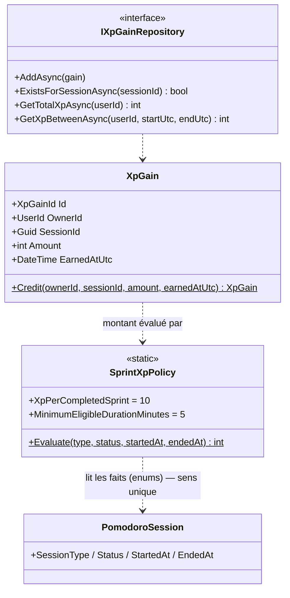
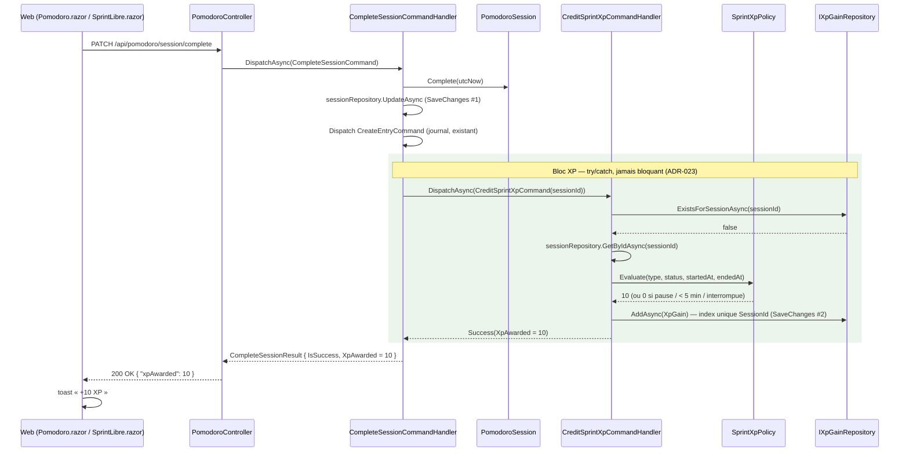
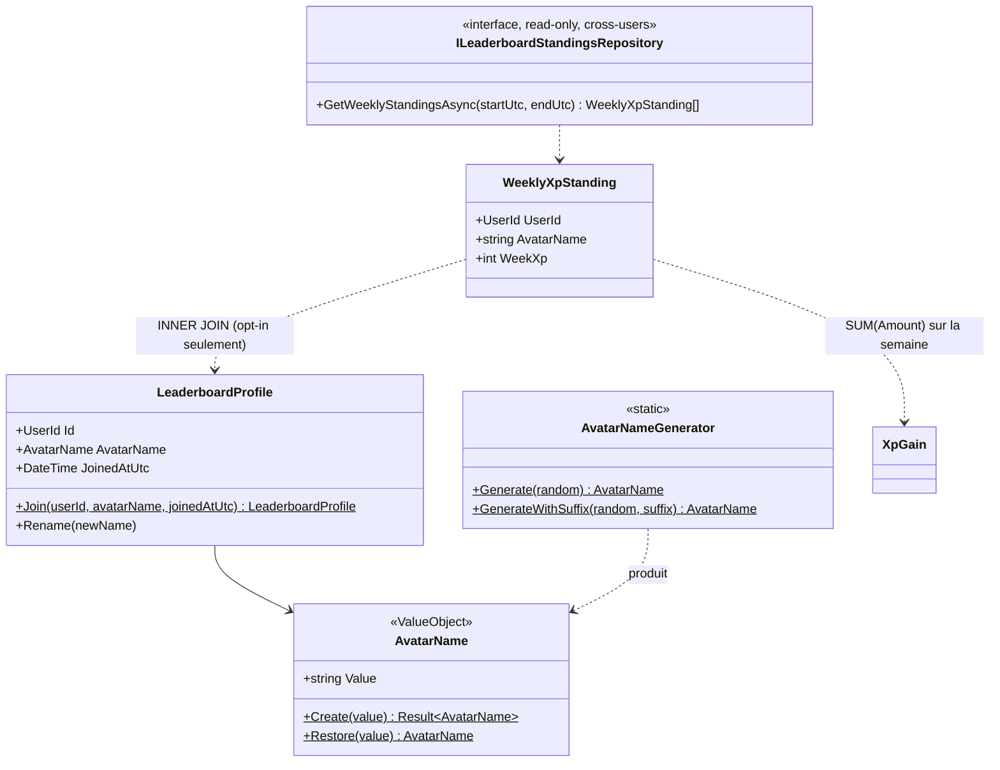

# Plan — Feature Gamification : XP personnel (A) + Leaderboard hebdomadaire (B)

> Modélisation `harold` — 2026-07-16. Consommé par `ada` (backend) et `blazor-ux` (front).
> Cadrage produit validé par `eva` (voir prompt d'itération). Périmètre strict : PAS de groupes entreprise (épic ultérieur, YAGNI).

---

## 0. Ancrage codebase (faits vérifiés — ne pas supposer autre chose)

| Fait | Preuve |
|---|---|
| Mediator réel : `Monbsoft.BrilliantMediator` (pas MediatR, pas d'injection directe des handlers) | `Program.cs:93` `AddBrilliantMediator().AddGeneratedHandlers().Build()` — handlers **source-générés**, aucun enregistrement DI manuel |
| Handlers : `ICommandHandler<TCmd,TResult>` (`Monbsoft.BrilliantMediator.Abstractions.Commands`) / `IQueryHandler<TQry,TResult>` (`...Abstractions.Queries`), méthode `Handle(cmd, ct = default)` | `CompleteSessionCommandHandler`, `GetFocusSummaryQueryHandler` |
| Dispatch : `IMediator.DispatchAsync<TCmd,TResult>` (commands) / `SendAsync<TQry,TResult>` (queries) | `PomodoroController`, `CompleteSessionCommandHandler:61` (dispatch in-process de `CreateEntryCommand` pour le journal — **précédent d'orchestration inter-BC**) |
| `RecordSprintCommand` **n'existe plus**. Sprint libre = `POST /api/pomodoro/session/free-sprint` → `StartSessionCommand(IsFreeSession: true)` (durée 0) ; fin via le **même** `PATCH /api/pomodoro/session/complete` → `CompleteSessionCommandHandler` | grep `RecordSprint` = 0 résultat ; `SprintLibre.razor:188` appelle `CompleteSessionAsync()` |
| **Un seul point d'intégration** pour l'attribution d'XP : `CompleteSessionCommandHandler` (standard ET libre). L'interruption passe par `InterruptSessionCommandHandler` → jamais d'XP | `PomodoroController:121-137` |
| Aucun dispatcher de domain events (support structurel `AggregateRoot.RaiseDomainEvent` seulement, `IDomainEvent` vide, 0 usage) | grep `IDomainEvent` : uniquement `AggregateRoot.cs` / `IDomainEvent.cs` |
| Chaque repository fait son propre `SaveChangesAsync` (pas d'Unit of Work partagé) | `EfCorePomodoroSessionRepository.AddAsync/UpdateAsync` |
| `UserId` = `record UserId(Guid Value)` ; `Users.Id` = `uniqueidentifier` ; template table per-user : `McpTokens` (UserId `uniqueidentifier` unique + FK → Users `Cascade`) | `UserId.cs`, `McpTokenConfiguration.cs`, snapshot |
| `PomodoroSessions.OwnerId` = `nvarchar(50)` (héritage) — les **nouvelles** tables suivent le pattern `McpTokens` (`uniqueidentifier`) | snapshot |
| `TimeProvider` enregistré en singleton, injecté dans les handlers récents | `Program.cs:90`, `GetFocusSummaryQueryHandler` |
| Résultats applicatifs : record par use case avec factories `Success`/`Failure` (ex. `CompleteSessionResult { IsSuccess, Error }`) | `CompleteSessionResult.cs` |
| Alias anti-conflit existants : `PomodoroErrors = KairuFocus.Domain.Pomodoro.DomainErrors` | `CompleteSessionCommandHandler.cs:8` |
| Requêtes date provider-safe : comparaison de bornes UTC `>= startUtc && < endUtc`, jamais de bucketing SQL (ADR-020/021) | `IPomodoroSessionRepository`, `EfCorePomodoroSessionRepository` |
| ⚠️ `project-state.md` (kairu-specs) dit « injection directe, pas de mediator » — **périmé**, le code fait foi | `Program.cs:93` |

---

## 1. Décisions d'architecture (résumé — détails en ADR §5)

1. **BC Gamification séparé** (dossier `Gamification/` dans chaque couche). Le langage (XP, ledger, avatar, classement) est étranger à Pomodoro ; `PomodoroSession` reste ignorante de la gamification (OCP) ; le leaderboard introduit la seule lecture cross-users de l'app — l'isoler dans un BC dédié en limite le rayon d'action. → ADR-022.
2. **Attribution par orchestration in-process** : `CompleteSessionCommandHandler` dispatche `CreditSprintXpCommand` via `IMediator` dans un `try/catch` (calqué sur le dispatch `CreateEntryCommand` journal existant). Pas de domain events : il n'existe aucun dispatcher et en construire un pour un seul consommateur serait de la sur-ingénierie. **`SaveChangesAsync` séparé** (inhérent au pattern repo du projet) : la complétion est déjà persistée quand l'XP est créditée — l'échec du crédit ne peut jamais annuler la complétion. → ADR-023.
3. **Persistance = ledger `XpGains` append-only + agrégation SQL (`SUM`)**. Pas de compteur dénormalisé : volumes minuscules (≤ ~20 lignes/jour/utilisateur), `SUM` indexé trivial, zéro risque de désynchronisation. Idempotence par **index unique sur `SessionId`** + pré-check. → ADR-022.
4. **Première requête cross-users** : interface de lecture seule dédiée `ILeaderboardStandingsRepository`, sans paramètre `userId`, qui ne joint que les profils **opt-in** et ne remonte que `(UserId, AvatarName, WeekXp)` — le `UserId` sert uniquement à localiser l'utilisateur courant côté Application et ne sort jamais de l'API. → ADR-024.
5. **Nom d'avatar** : listes curées **dans le Domain** (`AvatarNameGenerator`, statique, pur, `Random` injecté pour la testabilité). Unicité : pré-check + 5 retries, puis suffixe numérique (2–99), index unique DB en dernier rempart.
6. **Feedback « +10 XP »** : `CompleteSessionResult` gagne `XpAwarded` ; `PATCH /session/complete` passe de `204` à `200 { xpAwarded }`.
7. **Semaine = calendaire UTC (lundi 00:00 → lundi suivant)**, uniforme pour l'XP semaine et le leaderboard (équité globale > confort de fuseau ; divergence assumée avec l'offset client d'ADR-020, voir « À valider »).

---

## 2. Itération A — XP personnel

### 2.1 Règle métier (cadrage eva, verbatim)

- +10 XP si : `Status = Completed` **et** `SessionType = Sprint` (jamais les pauses) **et** durée effective `EndedAt − StartedAt ≥ 5 min`. Sinon **0 XP**. Uniforme standard/libre.
- Gain daté `EarnedAtUtc = session.EndedAt` (UTC). Idempotent (1 session = 1 crédit max).
- Pas de rétroactivité : ledger vide au départ, rien à backfiller.
- L'échec du crédit ne fait **jamais** échouer la complétion (log seulement).
- Lecture : XP totale + XP de la semaine calendaire UTC en cours.

### 2.2 Domain — `src/KairuFocus.Domain/Gamification/`

```
Gamification/
├── XpGainId.cs           # record XpGainId(Guid Value) + New()/From() — calqué PomodoroSessionId
├── XpGain.cs             # agrégat (ledger, immuable après création)
├── SprintXpPolicy.cs     # règle d'éligibilité pure
├── DomainErrors.cs       # static class DomainErrors.Gamification
└── IXpGainRepository.cs
```

```csharp
// XpGain.cs — agrégat append-only, aucune mutation après création
public sealed class XpGain : AggregateRoot<XpGainId>
{
    public UserId OwnerId { get; private set; }     // private set + ctor sans param protégé (EF)
    public Guid SessionId { get; private set; }     // Guid brut : pas de FK domaine vers Pomodoro
    public int Amount { get; private set; }
    public DateTime EarnedAtUtc { get; private set; }

    public static XpGain Credit(UserId ownerId, Guid sessionId, int amount, DateTime earnedAtUtc);
    // Garde : amount > 0, earnedAtUtc != default → sinon exception (bug programmeur, pas flux métier)
}

// SprintXpPolicy.cs — LA règle du cadrage, centralisée et testable sans I/O.
// Dépendance Gamification → Pomodoro (enums), unidirectionnelle, même assembly : acceptée (ADR-023).
public static class SprintXpPolicy
{
    public const int XpPerCompletedSprint = 10;
    public const int MinimumEligibleDurationMinutes = 5;

    /// <summary>Montant d'XP pour une session terminée. 0 si non éligible.</summary>
    public static int Evaluate(
        PomodoroSessionType sessionType,
        PomodoroSessionStatus status,
        DateTime? startedAt,
        DateTime? endedAt);
}

// DomainErrors.cs — alias conseillé côté Application : GamificationErrors
public static class DomainErrors
{
    public static class Gamification
    {
        public const string SessionNotFound = "Session not found for XP credit.";
        // Itération B ajoutera : AlreadyParticipating, NotParticipating, AvatarNamePoolExhausted…
    }
}

// IXpGainRepository.cs — ISP : uniquement ce dont l'itération A a besoin
public interface IXpGainRepository
{
    Task AddAsync(XpGain gain, CancellationToken cancellationToken = default);
    Task<bool> ExistsForSessionAsync(Guid sessionId, CancellationToken cancellationToken = default);
    Task<int> GetTotalXpAsync(UserId userId, CancellationToken cancellationToken = default);
    Task<int> GetXpBetweenAsync(UserId userId, DateTime startUtc, DateTime endUtc, CancellationToken cancellationToken = default);
}
```



### 2.3 Application — `src/KairuFocus.Application/Gamification/`

```
Gamification/
├── Common/UtcWeekWindow.cs
├── Commands/CreditSprintXp/
│   ├── CreditSprintXpCommand.cs        # record CreditSprintXpCommand(Guid SessionId)
│   ├── CreditSprintXpCommandHandler.cs
│   └── CreditSprintXpResult.cs         # { IsSuccess, int XpAwarded, string? Error }
└── Queries/GetXpSummary/
    ├── GetXpSummaryQuery.cs            # record GetXpSummaryQuery()
    ├── GetXpSummaryQueryHandler.cs
    └── GetXpSummaryResult.cs           # record GetXpSummaryResult(int TotalXp, int WeekXp)
```

```csharp
// UtcWeekWindow.cs — semaine calendaire UTC lundi–dimanche (bornes [StartUtc, EndUtc[)
public sealed record UtcWeekWindow(DateTime StartUtc, DateTime EndUtc)
{
    public static UtcWeekWindow From(DateTime utcNow); // lundi 00:00 UTC → lundi suivant 00:00 UTC
}
```

**`CreditSprintXpCommandHandler`** — dépendances : `IXpGainRepository`, `IPomodoroSessionRepository`, `ILogger<>`. Logique :
1. `ExistsForSessionAsync(SessionId)` → si vrai : `Success(XpAwarded: 0)` (**idempotence** ; le re-dispatch est sans effet).
2. `GetByIdAsync(PomodoroSessionId.From(SessionId))` (signature vérifiée) → null : `Failure(GamificationErrors.Gamification.SessionNotFound)`.
3. `SprintXpPolicy.Evaluate(session.SessionType, session.Status, session.StartedAt, session.EndedAt)` → 0 : `Success(XpAwarded: 0)` (pause, interrompue, < 5 min).
4. `XpGain.Credit(session.OwnerId, SessionId, amount, session.EndedAt!.Value)` → `AddAsync` (l'index unique DB est le dernier rempart contre une course) → `Success(XpAwarded: amount)`.

> Choix : commande minimale `(Guid SessionId)` + rechargement, plutôt que passer les faits de la session. Coût : 1 lecture ; gains : commande re-dispatchable telle quelle (rejeu après incident), source de vérité = état persisté, propriétaire lu depuis la session (pas d'ambiguïté `ICurrentUserService`).

**Modification `CompleteSessionCommandHandler`** (seul fichier Pomodoro touché) — après `UpdateAsync` et le dispatch journal existant :

```csharp
var xpAwarded = 0;
try
{
    var xpResult = await _mediator.DispatchAsync<CreditSprintXpCommand, CreditSprintXpResult>(
        new CreditSprintXpCommand(session.Id.Value), cancellationToken);
    if (xpResult.IsSuccess) xpAwarded = xpResult.XpAwarded;
    else _logger.LogError("XP credit failed for session {SessionId}: {Error}", session.Id.Value, xpResult.Error);
}
catch (Exception ex)  // règle cadrage : le crédit d'XP ne fait JAMAIS échouer la complétion
{
    _logger.LogError(ex, "XP credit failed for session {SessionId}", session.Id.Value);
}
return CompleteSessionResult.Success(xpAwarded);
```

**Modification `CompleteSessionResult`** : `+ int XpAwarded { get; init; }`, factory `Success(int xpAwarded = 0)`.

**`GetXpSummaryQueryHandler`** — dépendances : `IXpGainRepository`, `ICurrentUserService`, `TimeProvider`, `ILogger<>`. `TotalXp = GetTotalXpAsync(userId)` ; `WeekXp = GetXpBetweenAsync(userId, window.StartUtc, window.EndUtc)` avec `window = UtcWeekWindow.From(_timeProvider.GetUtcNow().UtcDateTime)`.



### 2.4 Infrastructure

- `KairuFocusDbContext` : `+ public DbSet<XpGain> XpGains => Set<XpGain>();` + `ApplyConfiguration(new XpGainConfiguration())`.
- `XpGainConfiguration` (calquée `McpTokenConfiguration`) :
  - table `XpGains` ; PK `Id` `uniqueidentifier` (conversion `XpGainId`), `ValueGeneratedNever`.
  - `OwnerId` `uniqueidentifier` NOT NULL (conversion `UserId`) + `HasOne<User>().WithMany().HasForeignKey(OwnerId).OnDelete(Cascade)` — la suppression d'un compte efface son XP.
  - `SessionId` `uniqueidentifier` NOT NULL + **index unique `IX_XpGains_SessionId`** (idempotence). Pas de FK vers `PomodoroSessions` : ledger historique autonome (survivrait à une purge de sessions) ; cohérent avec `SessionId` Guid brut côté domaine.
  - `Amount` `int` NOT NULL ; `EarnedAtUtc` `datetime2` NOT NULL.
  - Index composite `IX_XpGains_OwnerId_EarnedAtUtc` (lectures XP totale/semaine ET agrégat leaderboard en B).
- `EfCoreXpGainRepository` : `internal sealed`, `SaveChangesAsync` dans `AddAsync` (pattern maison) ; `GetTotalXpAsync`/`GetXpBetweenAsync` = `SumAsync` sur `Amount` (bornes UTC `>= startUtc && < endUtc`, provider-safe — `Sum` sur ensemble vide : utiliser `Select(g => (int?)g.Amount).SumAsync() ?? 0`, à vérifier à l'implémentation).
- `DependencyInjection.cs` : `+ services.AddScoped<IXpGainRepository, EfCoreXpGainRepository>();`
- Migration **`AddXpGains`** (handlers : aucun enregistrement, source-gen BrilliantMediator).

### 2.5 API

- `GamificationController` (`[ApiController] [Route("api/gamification")] [Authorize]`, injecte `IMediator`) :
  - `GET /api/gamification/xp` → `SendAsync<GetXpSummaryQuery, GetXpSummaryResult>` → `200 { totalXp, weekXp }`.
- `PomodoroController.CompleteSession` : `NoContent()` → `Ok(new { xpAwarded = result.XpAwarded })`. **Changement de contrat 204 → 200** : les clients Web/MAUI actuels testent `IsSuccessStatusCode` (`PomodoroApiClient.cs:98-102`), donc non cassant, mais à documenter dans spec.md.

### 2.6 Web (Blazor WASM — conception détaillée par `blazor-ux`)

- `PomodoroApiClient.CompleteSessionAsync()` : `Task<bool>` → `Task<int?>` (null = échec, sinon `xpAwarded`) — Web **et** MAUI (même signature dupliquée).
- `GamificationApiClient` + `XpSummaryDto(int TotalXp, int WeekXp)`.
- Feedback « +10 XP » en fin de sprint sur `Pomodoro.razor` et `SprintLibre.razor` (toast/animation — ne rien afficher si `xpAwarded == 0`).
- Affichage XP totale + XP semaine : emplacement à trancher par `blazor-ux` (dashboard « Focus aujourd'hui » ou `/stats`).
- MAUI : client HTTP aligné, UI reportée (cohérent #34/#35/#37).

### 2.7 Checklist Itération A

**Domain** (`KairuFocus.Domain.Tests/Gamification/`)
- [ ] `XpGainId`, `XpGain.Credit` (+ gardes)
- [ ] `SprintXpPolicy.Evaluate` — tests : `Should_Return10_When_CompletedSprintOfAtLeast5Minutes`, `Should_ReturnZero_When_DurationUnder5Minutes` (borne exacte 5:00 = éligible), `Should_ReturnZero_When_SessionIsBreak`, `Should_ReturnZero_When_SessionInterrupted`, `Should_ReturnZero_When_DatesMissing`, sprint libre ≥ 5 min = 10
- [ ] `DomainErrors.Gamification`, `IXpGainRepository`
**Application** (`KairuFocus.Application.Tests/Gamification/`)
- [ ] `UtcWeekWindow` (lundi, dimanche 23:59, changement d'année)
- [ ] `CreditSprintXpCommandHandler` : éligible / non éligible / session absente / **idempotence** (existe déjà → 0, pas d'Add)
- [ ] `CompleteSessionCommandHandler` : `Should_CompleteSession_When_XpCreditThrows` (**test clé du cadrage**), `Should_ReturnXpAwarded_When_SprintEligible` — MAJ tests existants (nouveau résultat)
- [ ] `GetXpSummaryQueryHandler` : bornes de semaine passées au repo
**Infrastructure**
- [ ] `XpGainConfiguration`, `EfCoreXpGainRepository`, DbSet, DI, migration `AddXpGains`, snapshot
**API**
- [ ] `GamificationController.GetXp`, `CompleteSession` → 200 + body
**Web**
- [x] `CompleteSessionAsync` → `int?` (Web), toast « +10 XP » (`Pomodoro.razor` + `SprintLibre.razor`), `GamificationApiClient`, affichage XP totale/semaine sur `/stats` — MAUI reporté (cohérent #34/#35/#37)

---

## 3. Itération B — Leaderboard hebdomadaire opt-in

### 3.1 Règles métier (cadrage eva + arbitrages fondateur du 2026-07-16)

- **Classement visible par tout utilisateur authentifié** (arbitrage fondateur : pas de réciprocité). L'opt-in explicite n'est requis que pour **apparaître** dans le classement.
- Nom d'avatar généré (adjectif + animal, listes curées), unique globalement, re-roll **à volonté** (aucune limite), **jamais** de saisie libre. Nouveau nom à chaque ré-adhésion.
- Classement semaine UTC en cours : top 10 (rang, avatar, XP semaine) + position de l'utilisateur courant si hors top 10. Ex-aequo = même rang. 0 XP = non classé.
- Opt-out immédiat ; XP personnelle conservée. Seules données exposées : rang, nom d'avatar, XP semaine.

### 3.2 Domain — ajouts dans `Gamification/`

```csharp
// AvatarName.cs — VO. Jamais de saisie libre : Create n'est appelé que par le générateur ;
// Restore(string) pour la matérialisation EF (pattern McpTokenHash.Restore).
public sealed record AvatarName
{
    public const int MaxLength = 60;
    public string Value { get; }
    public static Result<AvatarName> Create(string value); // non vide, ≤ 60, alphanumérique
    public static AvatarName Restore(string value);        // EF uniquement
}

// AvatarNameGenerator.cs — listes curées EN DUR dans le Domain (données métier stables, pur, zéro I/O).
// Français, format accolé « RenardAgile » (~50 animaux × ~40 adjectifs ≈ 2000 combinaisons).
public static class AvatarNameGenerator
{
    public static AvatarName Generate(Random random);
    public static AvatarName GenerateWithSuffix(Random random, int suffix); // « RenardAgile27 » (épuisement)
}

// LeaderboardProfile.cs — agrégat per-user, PK = UserId (précédent : UserSettings)
public sealed class LeaderboardProfile : AggregateRoot<UserId>
{
    public AvatarName AvatarName { get; private set; }
    public DateTime JoinedAtUtc { get; private set; }
    public static LeaderboardProfile Join(UserId userId, AvatarName avatarName, DateTime joinedAtUtc);
    public void Rename(AvatarName newName); // re-roll
}
// Opt-out = SUPPRESSION de la ligne (privacy par construction ; la ré-adhésion recrée
// un profil avec un nom fraîchement généré → règle « nouveau nom » gratuite).

// DomainErrors.Gamification — ajouts
public const string AlreadyParticipating = "User already participates in the leaderboard.";
public const string NotParticipating = "User does not participate in the leaderboard.";
public const string AvatarNamePoolExhausted = "Could not generate a unique avatar name.";

// ILeaderboardProfileRepository.cs
public interface ILeaderboardProfileRepository
{
    Task<LeaderboardProfile?> GetByUserIdAsync(UserId userId, CancellationToken cancellationToken = default);
    Task AddAsync(LeaderboardProfile profile, CancellationToken cancellationToken = default);
    Task UpdateAsync(LeaderboardProfile profile, CancellationToken cancellationToken = default);
    Task RemoveAsync(LeaderboardProfile profile, CancellationToken cancellationToken = default);
    Task<bool> IsAvatarNameTakenAsync(string avatarName, CancellationToken cancellationToken = default);
}

// ILeaderboardStandingsRepository.cs — PREMIÈRE lecture cross-users de l'app (ADR-024).
// Lecture seule, pas de paramètre userId (choix conscient), ne joint que les profils opt-in,
// ne remonte que des champs anonymisés + UserId (usage interne Application uniquement).
public interface ILeaderboardStandingsRepository
{
    Task<IReadOnlyList<WeeklyXpStanding>> GetWeeklyStandingsAsync(
        DateTime startUtc, DateTime endUtc, CancellationToken cancellationToken = default);
}
public sealed record WeeklyXpStanding(UserId UserId, string AvatarName, int WeekXp);
```



### 3.3 Application — ajouts dans `Gamification/`

```
├── Common/LeaderboardRanker.cs                  # classe pure (miroir StreakCalculator)
├── Commands/JoinLeaderboard/       → JoinLeaderboardCommand() / Handler / Result { IsSuccess, string? AvatarName, Error }
├── Commands/LeaveLeaderboard/      → LeaveLeaderboardCommand() / Handler / Result { IsSuccess, Error }
├── Commands/RerollAvatarName/      → RerollAvatarNameCommand() / Handler / Result { IsSuccess, string? AvatarName, Error }
└── Queries/GetLeaderboard/         → GetLeaderboardQuery() / Handler / Result
```

```csharp
public sealed record LeaderboardEntryViewModel(int Rank, string AvatarName, int WeekXp, bool IsCurrentUser);
public sealed record GetLeaderboardResult(
    bool IsParticipant,
    IReadOnlyList<LeaderboardEntryViewModel> Top,   // top 10
    LeaderboardEntryViewModel? CurrentUser);        // si hors top 10 et WeekXp > 0 ; null si 0 XP (non classé)

// LeaderboardRanker.cs — pur, testable sans I/O.
// Classement « standard competition » : 10, 8, 8, 5 → rangs 1, 2, 2, 4. Exclut WeekXp == 0.
public static class LeaderboardRanker
{
    public static GetLeaderboardResult Rank(
        IReadOnlyList<WeeklyXpStanding> standings, UserId currentUserId, int topCount = 10);
}
```

- **`JoinLeaderboardCommandHandler`** (`ILeaderboardProfileRepository`, `ICurrentUserService`, `TimeProvider`, `ILogger<>`) : profil existant → `Failure(AlreadyParticipating)`. Génération : 5 × `Generate` + `IsAvatarNameTakenAsync` ; puis 10 × `GenerateWithSuffix` (suffixe aléatoire 2–99) ; épuisement → `Failure(AvatarNamePoolExhausted)` (log Error). `AddAsync` — l'index unique DB attrape la course résiduelle (exception propagée : rarissime, retry client).
- **`LeaveLeaderboardCommandHandler`** : absent → `Failure(NotParticipating)` ; sinon `RemoveAsync`. **Aucune action sur `XpGains`** (XP conservée).
- **`RerollAvatarNameCommandHandler`** : absent → `Failure(NotParticipating)` ; même boucle de génération ; `Rename` + `UpdateAsync`.
- **`GetLeaderboardQueryHandler`** (`ILeaderboardProfileRepository`, `ILeaderboardStandingsRepository`, `ICurrentUserService`, `TimeProvider`) : toujours `GetWeeklyStandingsAsync(UtcWeekWindow)` → `LeaderboardRanker.Rank(...)` — le classement est public (arbitrage fondateur). `IsParticipant` (profil non null) sert au client pour afficher le CTA d'opt-in ; pour un non-participant, `CurrentUser = null` (il n'apparaît dans aucune ligne).

### 3.4 Infrastructure

- `KairuFocusDbContext` : `+ DbSet<LeaderboardProfile> LeaderboardProfiles` + configuration.
- `LeaderboardProfileConfiguration` (calquée `McpTokenConfiguration` / `UserSettings` per-user) :
  - table `LeaderboardProfiles` ; **PK `UserId`** `uniqueidentifier` (conversion) ; FK → `Users` `Cascade`.
  - `AvatarName` `nvarchar(60)` NOT NULL (conversion `Value`/`Restore`) + **index unique `IX_LeaderboardProfiles_AvatarName`**.
  - `JoinedAtUtc` `datetime2` NOT NULL.
- `EfCoreLeaderboardProfileRepository` + `EfCoreLeaderboardStandingsRepository` (`GROUP BY` LINQ : `XpGains` filtrés `EarnedAtUtc >= startUtc && < endUtc`, join `LeaderboardProfiles` sur `OwnerId == profile.Id`, `Sum(Amount)` — bornes UTC provider-safe, `IX_XpGains_OwnerId_EarnedAtUtc` déjà en place depuis A).
- DI : 2 `AddScoped`. Migration **`AddLeaderboardProfiles`**.

### 3.5 API — `GamificationController` (suite)

| Endpoint | Use case | Réponses |
|---|---|---|
| `GET /api/gamification/leaderboard` | `GetLeaderboardQuery` | `200 { isParticipant, top: [{rank, avatarName, weekXp, isCurrentUser}], currentUser? }` — classement retourné à tout utilisateur authentifié ; `isParticipant` pilote le CTA d'opt-in côté client |
| `POST /api/gamification/leaderboard/membership` | `JoinLeaderboardCommand` | `201 { avatarName }` / `409` AlreadyParticipating / `503` PoolExhausted |
| `DELETE /api/gamification/leaderboard/membership` | `LeaveLeaderboardCommand` | `204` / `404` NotParticipating |
| `POST /api/gamification/leaderboard/membership/reroll` | `RerollAvatarNameCommand` | `200 { avatarName }` / `404` NotParticipating |

Jamais exposés : login, nom, email, avatar GitHub, `UserId` d'autrui.

### 3.6 Web (conception `blazor-ux`)

- Page `/leaderboard` (ou section stats) : classement visible par tous ; non-participant → bannière/CTA opt-in (explication de ce qui deviendra visible : avatar + XP semaine + rang) au-dessus du top 10 ; participant → mise en évidence de sa ligne, position hors top 10, état « non classé cette semaine » si 0 XP, re-roll, opt-out (confirmation : « votre XP est conservée »).
- `GamificationApiClient` : 4 méthodes + DTOs miroir. Entrée nav. MAUI reporté.

### 3.7 Checklist Itération B

**Domain**
- [ ] `AvatarName` (Create/Restore, bornes), `AvatarNameGenerator` (déterminisme avec `Random` seedé, format, suffixe), `LeaderboardProfile` (Join/Rename), erreurs, 2 interfaces repo + `WeeklyXpStanding`
**Application**
- [ ] `LeaderboardRanker` : ex-aequo (1,2,2,4), exclusion 0 XP, top 10, current user dans/hors top, non classé
- [ ] `JoinLeaderboard` : nominal, AlreadyParticipating, collision → retry, épuisement → suffixe, échec total
- [ ] `LeaveLeaderboard` : nominal (XpGains intouchés), NotParticipating
- [ ] `RerollAvatarName` : nominal, NotParticipating
- [ ] `GetLeaderboard` : non-participant → classement retourné avec `IsParticipant=false` et `CurrentUser=null`, fenêtre UTC correcte
**Infrastructure**
- [ ] Config + 2 repos + DbSet + DI + migration `AddLeaderboardProfiles` + snapshot
**API**
- [ ] 4 endpoints + mapping erreurs → codes HTTP
**Web**
- [ ] Page leaderboard, opt-in/opt-out/re-roll, client API

---

## 4. Récapitulatif use cases & endpoints

| It. | Type | Use case | Endpoint |
|---|---|---|---|
| A | Command (interne) | `CreditSprintXp` | — (dispatché par `CompleteSessionCommandHandler`) |
| A | Query | `GetXpSummary` | `GET /api/gamification/xp` |
| A | (modifié) | `CompleteSession` → `XpAwarded` | `PATCH /api/pomodoro/session/complete` → `200 { xpAwarded }` |
| B | Command | `JoinLeaderboard` | `POST /api/gamification/leaderboard/membership` |
| B | Command | `LeaveLeaderboard` | `DELETE /api/gamification/leaderboard/membership` |
| B | Command | `RerollAvatarName` | `POST /api/gamification/leaderboard/membership/reroll` |
| B | Query | `GetLeaderboard` | `GET /api/gamification/leaderboard` |

Migrations : `AddXpGains` (A) — table `XpGains` (PK `Id`, `OwnerId` FK Users Cascade, `SessionId` **unique**, `Amount`, `EarnedAtUtc`, index `IX_XpGains_OwnerId_EarnedAtUtc`) ; `AddLeaderboardProfiles` (B) — table `LeaderboardProfiles` (PK `UserId` FK Users Cascade, `AvatarName` nvarchar(60) **unique**, `JoinedAtUtc`).

---

## 5. Brouillons d'ADR (à porter dans `kairu-specs/spec.md` à l'étape DOCUMENTER)

### ADR-022 — BC Gamification séparé avec ledger `XpGains` agrégé à la lecture

- **Contexte :** La gamification (XP par sprint complété, futur leaderboard) doit être branchée sur la complétion des sessions Pomodoro. Deux formes possibles : étendre le BC Pomodoro (champ XP sur la session, compteurs sur un profil), ou créer un BC dédié. Il faut aussi choisir entre un ledger de gains agrégé à la lecture et des totaux dénormalisés.
- **Décision :** Nouveau BC **Gamification** (`Domain/Gamification`, `Application/Gamification`, `GamificationController`). Persistance en **ledger append-only `XpGains`** (`Id`, `OwnerId`, `SessionId` unique, `Amount`, `EarnedAtUtc`) ; XP totale et hebdomadaire calculées par `SUM` SQL (index `IX_XpGains_OwnerId_EarnedAtUtc`). Aucun total dénormalisé. Idempotence garantie par l'index unique sur `SessionId`. Pas de rétroactivité : le ledger démarre vide. Semaine = calendaire **UTC** (lundi–dimanche), uniforme XP semaine / leaderboard.
- **Conséquences :**
  - (+) `PomodoroSession` reste ignorante de la gamification (OCP) ; langage ubiquitaire propre (gain, ledger, avatar, classement) ; le BC pourra évoluer (niveaux, badges) sans toucher Pomodoro.
  - (+) Ledger = source de vérité auditable, datée `EndedAt`, aucune désynchronisation possible ; volumes minuscules (≤ ~20 lignes/jour/utilisateur) donc `SUM` indexé trivial.
  - (−) Deux lectures agrégées par affichage XP (total + semaine) — négligeable à cette échelle ; dénormalisation possible plus tard si mesuré nécessaire.
  - (−) `SprintXpPolicy` (Gamification) lit les enums Pomodoro : couplage **unidirectionnel** Gamification → Pomodoro au sein de l'assembly Domain, assumé (l'inverse est interdit).
- **Alternatives écartées :** extension du BC Pomodoro (pollue un agrégat déjà fusionné standard/libre en #23, mélange les langages) ; compteurs dénormalisés (risque de dérive, YAGNI) ; champ `XpAwarded` sur `PomodoroSession` (pas idempotent par construction, pas de date de gain propre, migration sur table existante).

### ADR-023 — Attribution d'XP par orchestration in-process non bloquante (pas de domain events)

- **Contexte :** L'XP doit être créditée à la complétion d'une session (standard et libre passent toutes deux par `CompleteSessionCommandHandler` depuis la fusion #23 — point d'intégration unique). Le cadrage impose : l'échec du crédit ne doit **jamais** faire échouer la complétion. Le codebase n'a **aucun dispatcher de domain events** (`AggregateRoot.RaiseDomainEvent` existe mais rien ne publie), et un précédent d'orchestration in-process existe déjà : le dispatch de `CreateEntryCommand` (journal) par ce même handler via `IMediator` (BrilliantMediator).
- **Décision :** `CompleteSessionCommandHandler` dispatche `CreditSprintXpCommand(sessionId)` via `IMediator`, **après** la persistance de la complétion, dans un **`try/catch` + `LogError`**. Le crédit fait son propre `SaveChangesAsync` (**transaction séparée** — inhérent au pattern « un repo = son SaveChanges » du projet). La décision d'éligibilité (Sprint, Completed, ≥ 5 min, +10) vit dans `SprintXpPolicy` (Domain Gamification) — Pomodoro ne connaît pas la règle. Le résultat expose `XpAwarded` pour le feedback client « +10 XP » (`PATCH /session/complete` : 204 → `200 { xpAwarded }`).
- **Conséquences :**
  - (+) Complétion jamais bloquée (exigence cadrage) ; l'inverse (XP sans complétion) est impossible car le crédit vient après la persistance.
  - (+) Pattern identique au journal : cohérence, zéro nouvelle infrastructure ; handler XP re-dispatchable (idempotent via pré-check + index unique `SessionId`).
  - (−) Non-atomique : une complétion peut rester sans XP en cas de panne entre les deux SaveChanges (accepté : journalisation seulement ; rejouable manuellement via re-dispatch grâce à l'idempotence).
  - (−) `CompleteSessionCommandHandler` gagne une dépendance d'orchestration de plus ; si un 3e consommateur de « session complétée » apparaît, reconsidérer un vrai dispatch d'événements domaine.
- **Alternatives écartées :** domain events + dispatcher (à construire de zéro pour un seul consommateur — sur-ingénierie ici, YAGNI) ; crédit inline dans le handler Pomodoro (viole la séparation des BC, disperse la règle) ; même transaction (couplerait l'échec XP à la complétion, contraire au cadrage).

### ADR-024 — Leaderboard : première requête cross-users via repository de lecture dédié et anonymisé

- **Contexte :** Depuis #15, toutes les lectures sont filtrées par `UserId` (`ICurrentUserService`). Le leaderboard hebdomadaire nécessite, pour la première fois, une lecture **cross-users**. Il faut l'autoriser sans affaiblir la règle générale ni exposer de données personnelles (exigence : rang, nom d'avatar, XP semaine — jamais login/nom/email/avatar GitHub).
- **Décision :** Interface dédiée **`ILeaderboardStandingsRepository`** (Domain/Gamification), **lecture seule**, une seule méthode `GetWeeklyStandingsAsync(startUtc, endUtc)` **sans paramètre `userId`** — l'absence de filtre est explicite et localisée. L'implémentation joint `XpGains` aux seuls profils **opt-in** (`LeaderboardProfiles`, INNER JOIN) et projette `WeeklyXpStanding(UserId, AvatarName, WeekXp)`. Le `UserId` sert uniquement, en couche Application, à localiser la position de l'utilisateur courant ; l'API n'expose jamais le `UserId` d'autrui. Le classement est **public** pour tout utilisateur authentifié (arbitrage fondateur 2026-07-16) : seule l'**apparition** dans le classement exige l'opt-in — les données servies restent anonymisées par construction. L'opt-out **supprime** le profil (disparition immédiate du classement) ; l'XP (`XpGains`) est conservée ; la ré-adhésion génère un nouveau nom d'avatar.
- **Conséquences :**
  - (+) L'exception au filtrage par utilisateur est cantonnée à une interface d'une méthode, auditable en un point (ISP) ; anonymisation par construction (la projection SQL ne touche jamais la table `Users`).
  - (+) Classement (ex-aequo, top 10, position courante) calculé dans `LeaderboardRanker` pur — testable sans I/O (cohérent ADR-020/021).
  - (−) La méthode matérialise tous les participants actifs de la semaine (XP > 0) pour calculer la position hors top 10 — acceptable à l'échelle actuelle ; si la base grossit, remplacer par deux requêtes SQL (top N + rang de l'utilisateur).
- **Alternatives écartées :** méthode cross-users sur un repository existant (diluerait l'exception au milieu de méthodes filtrées) ; vue SQL/projection dénormalisée (YAGNI) ; pseudonymisation côté client (les données quitteraient le serveur non anonymisées — inacceptable).

---

## 6. Hors scope (YAGNI — ne rien préparer pour)

Groupes/leaderboards d'entreprise, niveaux/badges/récompenses, XP rétroactive, historique des semaines passées, notifications, saisie libre du nom d'avatar, dénormalisation des totaux, dispatcher de domain events.
